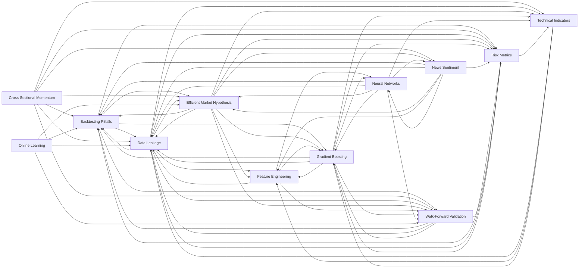

# Home — the-network second brain

> Auto-generated by `src/brain.py` (`python scripts/build_brain.py`). Edit the notes under `brain/concepts/`, not this file.

**12 concepts · 65 links.** Curated, leak-free reference for the methods this repo actually uses. Fundamentals are written once and only updated when our methods change — they are not re-researched on a schedule.

## Concept map

## Concepts

- [Backtesting Pitfalls](../concepts/backtesting-pitfalls.md) — A backtest is a simulation, and simulations lie when you let them. Even with correct Walk-Forward Validation, these traps remain.
- [Cross-Sectional Momentum](../concepts/cross-sectional-momentum.md) — Cross-sectional ranking asks a different question than single-stock timing. Instead of "will AAPL go up tomorrow?" it asks "which stocks will *outperform the others*?" and holds the top-ranked basket, rebalancing periodically. Most durable equity anomalies — momentum, value, quality — are cross-sectional, which is why this is a more legitimate place to look for an edge than single-name timing against the Efficient Market Hypothesis.
- [Data Leakage](../concepts/data-leakage.md) — Leakage is when information that would not have been available at decision time sneaks into training or features. It is the number-one cause of backtests that look brilliant and lose money live. Treat every suspiciously good result as leakage until proven otherwise.
- [Efficient Market Hypothesis](../concepts/efficient-market-hypothesis.md) — The EMH holds that prices already reflect available information, so consistently predicting future returns from public data is very hard. It is the single most important prior for this whole project — the reason we expect modest results and distrust impressive ones.
- [Feature Engineering](../concepts/feature-engineering.md) — Turning raw OHLCV bars into a model-ready matrix. In this repo it is the most correctness-critical step and lives in `src/features.py`.
- [Gradient Boosting](../concepts/gradient-boosting.md) — Gradient boosting builds an ensemble of shallow decision trees sequentially: each new tree fits the residual errors of the current ensemble. The sum of many weak learners becomes a strong one. It is the workhorse for tabular prediction.
- [Neural Networks](../concepts/neural-networks.md) — A neural network is a stack of layers that learn a function from inputs to outputs by adjusting weights via gradient descent on a loss. Each layer applies a linear transform followed by a non-linearity; depth lets the network compose simple patterns into complex ones.
- [News Sentiment](../concepts/news-sentiment.md) — Markets react to news, and reactions can over- or under-shoot — a documented source of short-lived inefficiency under the Efficient Market Hypothesis. This repo captures news as **research context**, not (yet) as a trade input.
- [Online Learning](../concepts/online-learning.md) — "Online" (or continual) learning means updating the model on each new datapoint as it arrives, rather than retraining in batches. It sounds like the obvious way to make a system "always learn from its mistakes." For noisy financial data it is mostly a footgun, and this repo deliberately does **not** do it per tick.
- [Risk Metrics](../concepts/risk-metrics.md) — Returns without risk context are meaningless. A 30% return from 60% drawdowns is worse than 12% from 8% drawdowns. These are the metrics `src/backtest.py` reports, always alongside a buy-and-hold benchmark.
- [Technical Indicators](../concepts/technical-indicators.md) — Indicators are deterministic transforms of past price/volume meant to summarise trend, momentum, mean-reversion, and volatility. They are the raw material for Feature Engineering in this repo (`src/features.py`).
- [Walk-Forward Validation](../concepts/walk-forward-validation.md) — The only honest way to evaluate a time-series trading model. Standard k-fold cross-validation **shuffles rows**, which trains on the future to predict the past — pure Data Leakage. Walk-forward never does that.

## Related

- News intelligence log: `brain/news/` (per-ticker, point-in-time).
- Methodology lives in code: `src/features.py`, `src/backtest.py`.
